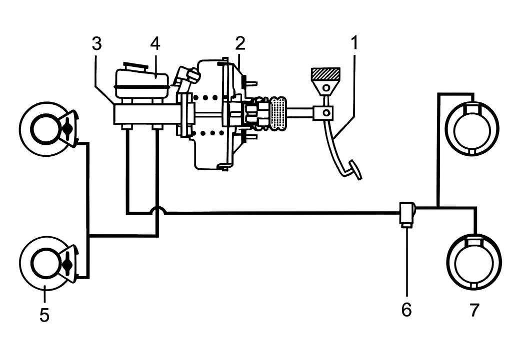

## Hlavné časti

Hydraulický brzdový systém sa skladá z nasledujúcich hlavných častí:

1. **Brzdový pedál**
2. **Podtlakový posilňovač**
3. **Hlavný (dvojokruhový) brzdový valec**
4. **Okruh predných bŕzd**
5. **Okruh zadných bŕzd**
6. **Predné brzdy**
7. **Zadné brzdy**
8. **Nádržka na brzdovú kvapalinu**

## Princíp činnosti:

Keď vodič stlačí brzdový pedál, piest v hlavnom brzdovom valci vytvorí tlak v brzdovej kvapaline. Tento tlak sa prenáša potrubím do brzdových valčekov pri kolesách, kde posúva piesty. Piesty pritláčajú brzdové obloženia na kotúče alebo bubny, čím vzniká trenie a brzdná sila.

## Usporiadanie brzdových okruhov

Ako sme spomínali už v požiadavkách, prevádzková brzda musí mať vždy dva samostatné brzdové okruhy, ktoré môžu byť usporiadané nasledovne:

**TT usporidanie**

{image}

**Diagonálne usporiadanie**

{image}

**HT usporiadanie**

{image}

**LL usporiadanie**

{image}

**HH usporiadanie**

{image}

Nasledujúce učivo:

  
