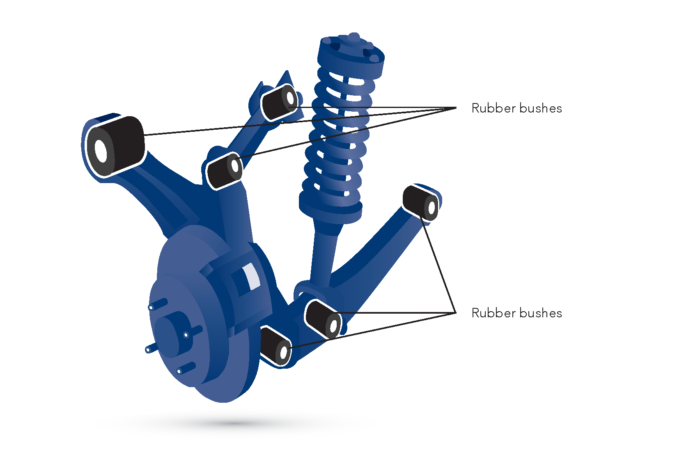

Gumové pruženie využíva elastické vlastnosti gumy (prírodnej alebo syntetickej) na absorbovanie nárazov a vibrácií. Guma zároveň pôsobí ako tlmič vďaka vnútornému treniu, ktoré premieňa energiu na teplo.

## Výhody:

- Samotlmiaci efekt
- Nízka cena a jednoduchá výroba
- Tichá prevádzka (izoluje hluk a vibrácie)
- Jednoduchá konštrukcia bez potreby mazania
- Odolnosť voči korózii
- Nízka hmotnosť

## Nevýhody:

- Obmedzená životnosť (stárnutie gumy vplyvom UV žiarenia a ozónu)
- Závislosť vlastností od teploty (tvrdne v mraze, mäkne v teple)
- Nižšia únosnosť v porovnaní s kovovými pružinami
- Progresívna charakteristika (tuhosť rastie so stlačením)

## Použitie:

- Uloženie motora a prevodovky (silentbloky na tlmenie vibrácií)
- Pomocné pružiny (tzv. dorazy alebo buffery)
- Uloženie náprav a ramien zavesenia
- Malé motocykle a skútre
- Nízkorýchlostné vozidlá (napr. vysokozdvižné vozíky)

