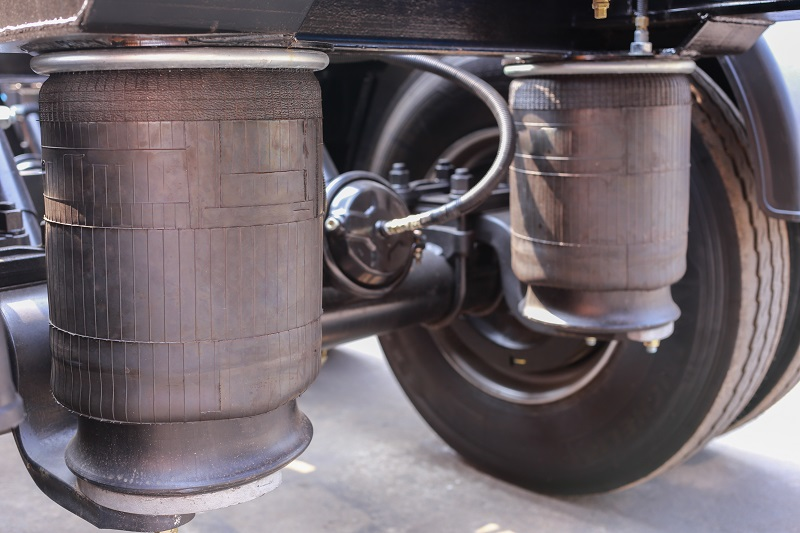

Pneumatické pruženie je systém odpruženia, ktorý využíva stlačený vzduch uzavretý v pružných vakoch (mechoch) na absorbovanie nerovností vozovky. Na rozdiel od oceľových pružín umožňuje plynulé nastavenie výšky a tuhosti odpruženia podľa aktuálnych podmienok a zaťaženia vozidla.

## Konštrukcia

**Hlavné časti pneumatického pruženia:**
1 - Vzduchové mechy (vaky) - pružné gumové komory naplnené stlačeným vzduchom
2 - Kompresor - stláča vzduch a dodáva ho do systému
3 - Sušič - odvádza vlhkosť zo systému (často integrovaný priamo v kompresore)  
4 - Zásobník vzduchu (akumulátor) - uchováva stlačený vzduch (pre rýchle nastavenie svetlej výšky)
5 - Vzduchové vedenia - potrubia spájajúce komponenty
6 - Regulačné ventily - riadia prúdenie vzduchu do jednotlivých mechov
7 - Snímače výšky - monitorujú polohu karosérie voči kolesám
8 - Riadiaca jednotka - spracováva údaje a ovláda celý systém

{image of air suspension components with descriptions}

## Princíp činnosti

Snímače výšky neustále monitorujú polohu karosérie voči kolesám. Pri zmene zaťaženia alebo prejazde nerovnosťou riadiaca jednotka vyhodnotí údaje a prostredníctvom ventilov upraví tlak vzduchu v mechoch. Zvýšením tlaku sa vozidlo zdvihne a odpruženie stvrdne, znížením tlaku sa vozidlo zníži a odpruženie zmäkne. Tento proces prebieha automaticky a nepretržite.

## Výhody:

- Automatické udržiavanie konštantnej výšky vozidla bez ohľadu na zaťaženie
- Možnosť nastavenia tuhosti odpruženia (komfort/šport)
- Vysoký komfort jazdy aj pri rôznom zaťažení
- Progresívna charakteristika (tuhosť rastie so stlačením)
- Možnosť manuálnej zmeny výšky (napr. pre terén alebo nakladanie)
- Výborná izolácia karosérie od vibrácií

## Nevýhody:

- Vysoká cena systému aj údržby
- Zložitá konštrukcia s množstvom komponentov
- Možnosť porúch elektroniky, úniku vzduchu alebo zamrznutia kondezovanej vody v systéme
- Zaberá veľa priestoru
- Neprenášajú pozdĺžne ani priečne sily - vyžadujú samostatné vedenie nápravy (ramená, vzpery)

## Rozdelenie

### Podľa konštrukcie vzduchových mechov:

1. **Vlnovcové mechy**
   - Tvar vlnovca (harmoniky)
   - Väčší zdvih, mäkšia charakteristika
   - Používané v osobných automobiloch

2. **Valivé mechy**
   - Valcový tvar s odvaľovaním po pieste
   - Kompaktnejšia konštrukcia
   - Používané v nákladných vozidlách a autobusoch

### Podľa typu systému:

1. **Čisto pneumatické pruženie**
   - Využíva iba stlačený vzduch
   - Jednoduchšia konštrukcia

2. **Hydropneumatické pruženie**
   - Kombinácia stlačeného plynu (dusík) a hydraulickej kvapaliny
   - Plyn slúži ako pružina, kvapalina prenáša sily a tlmí
   - Známe z vozidiel Citroën (systém Hydractive)
   - Veľmi vysoký komfort a možnosť regulácie

## Použitie:

- Luxusné osobné automobily (Mercedes-Benz S-Class, Audi A8, Range Rover)
- Autobusy (komfort cestujúcich a automatické nakláňanie pri nastupovaní)
- Ťažké nákladné automobily (konštantná výška nakladacej plochy)
- Prívesy a návesy
- Terénne vozidlá (nastaviteľná svetlá výška)
