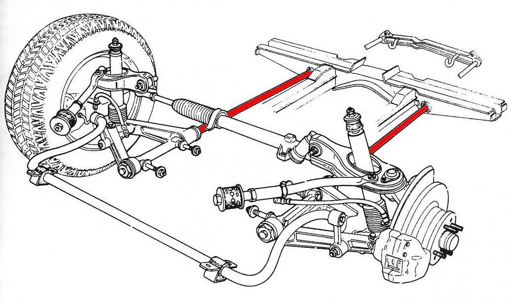
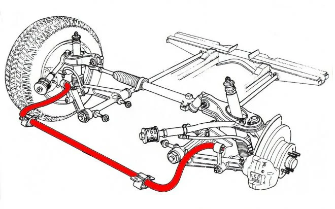

Skrutná (torzná) tyč je typ pružiny, ktorá využíva krútenie (torziu) oceľovej tyče na absorbovanie nerovností vozovky. Na rozdiel od vinutých alebo listových pružín, torzná tyč poskytuje pružinový efekt prostredníctvom odporu voči krúteniu okolo svojej pozdĺžnej osi.

## Konštrukcia

Skrutná tyč je dlhý oceľový prút vyrobený z vysokokvalitnej pružinovej ocele. Má najčastejšie kruhový prierez, ktorý je na oboch koncoch zosilnený a vybavený jemne drážkovanou (ozubenou) hlavicou na upevnenie.

**Hlavné časti:**
1 - Torzná tyč (kruhový alebo profilovaný prierez)
2 - Upevňovacie čapy s drážkami
3 - Rameno zavesenia (spodné alebo horné)
4 - Nastavovací mechanizmus (skrutka alebo excentrická podložka)
5 - Rám alebo karoséria vozidla
6 - Ochranné puzdro (gumové alebo plastové)

{image of torsion bar construction with descriptions}

## Princíp činnosti

Jeden koniec torznej tyče sa pevne uchytáva v ráme alebo karosérii vozidla, druhý koniec je spojený s ramenom zavesenia kolesa. Pri pohybe kolesa nahor sa rameno zavesenia otáča a spôsobuje krútenie (torziu) tyče okolo jej pozdĺžnej osi. Odpor tyče voči tomuto krúteniu vytvára pružinový efekt, ktorý absorbuje energiu nárazu. Po prejazde nerovnosti sa tyč vráti do pôvodnej polohy vďaka svojej elasticite.

Poznámka k dimenzovaniu: uhol skrútenia torznej tyče rastie s pôsobiacim momentom a dĺžkou tyče a klesá s tuhosťou tyče (danou materiálom a prierezom). Presné dimenzovanie je predmetom konštrukčného výpočtu a skúšok a je špecifické pre každé vozidlo.

## Výhody torzných tyčí:

- Veľmi kompaktné riešenie (zaberajú málo miesta, umožňujú nižšiu podlahu vozidla)
- Nízka hmotnosť v porovnaní s listovými pružinami
- Jednoduché nastavenie výšky vozidla zmenou predpätia tyče
- Vysoká spoľahlivosť a dlhá životnosť
- Rovnomerné zaťaženie materiálu po celej dĺžke tyče
- Možnosť individuálneho nastavenia tuhosti výmenou tyče
- Odolnosť voči vysokému zaťaženiu

## Nevýhody torzných tyčí:

- Obmedzená schopnosť absorbovať veľké nárazy v porovnaní s vinutými pružinami
- Potreba presného uloženia a správneho predpätia
- Náchylnosť na únavu materiálu pri dlhodobom používaní
- Náchylnosť na koróziu (povrchové vady sú kritické pre životnosť)
- Potreba ochranného povlaku alebo puzdra
- Zaberajú priestor pod podlahou vozidla (môže obmedzovať svetlú výšku)
- Náročnejšia výmena v porovnaní s vinutými pružinami

## Použitie

Torzné tyče sa používajú v rôznych typoch vozidiel:

**Osobné automobily:**
- Predné nezávislé zavesenie (napr. VW Beetle, Porsche 911, mnohé francúzske autá ako Citroën, Peugeot, Renault)
- Zadné zavesenie niektorých vozidiel
- Vozidlá značiek Chrysler, Ford, GM, Mitsubishi, Mazda, Nissan, Toyota

**Terénne vozidlá a SUV:**
- Predné nezávislé zavesenie (vhodné pre náročné terénne podmienky)
- Nákladné automobily a pick-upy

**Vojenské vozidlá:**
- Tanky (napr. M1 Abrams, Leopard 2, historický Panther)
- Obrnené vozidlá (robustné odpruženie pre extrémne podmienky)

**Stabilizačné tyče (anti-roll bar):**
Torzná tyč sa využíva aj v stabilizačných tyčiach (tzv. anti-roll bar alebo anti-sway bar), ktoré znižujú naklonenie vozidla v zákrutách alebo pri prejazde po nerovnostiach. Stabilizačná tyč pružne spája ľavé a pravé koleso nápravy tak, že pri stlačení jedného z nich donúti stlačiť aj to druhé, čím pomáha udržať vozidlo v rovnovážnej polohe a taktiež znižuje celkové tažisko vozidla, čo v zákrutách robí vozidlo ešte stabilnejším.

